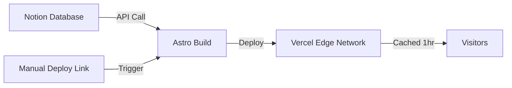

# Deployment Guide for Pri's Digital Garden

## Overview

This blog is deployed on **Vercel** and fetches content from **Notion** using the Notion API. It uses **Incremental Static Regeneration (ISR)** to cache pages at the edge for 1 hour, ensuring fast loads while keeping content fresh.

---

## Architecture



**Key Features**:
- ✅ **Server-side rendering** with Vercel adapter
- ✅ **ISR caching** - Pages cached for 1 hour at the edge
- ✅ **Manual deployment** via Deploy Hook bookmark
- ✅ **No scheduled builds** - Deploy only when you publish new content

---

## One-Time Setup

### 1. Vercel Environment Variables

Your Notion credentials must be configured in Vercel:

**Required Variables**:
- `NOTION_API_KEY` - Your Notion integration token
- `NOTION_DATABASE_ID` - Your Notion database ID

**How to set them**:
1. Go to [Vercel Dashboard](https://vercel.com/dashboard)
2. Select your project (Pri's blog)
3. Go to **Settings** → **Environment Variables**
4. Add both variables for **Production**, **Preview**, and **Development** environments
5. Click **Save**

**Finding your values**:
- **NOTION_API_KEY**: Go to [notion.so/my-integrations](https://www.notion.so/my-integrations) and copy your Internal Integration Token
- **NOTION_DATABASE_ID**: Open your Notion database in browser, the ID is in the URL: `notion.so/[workspace]/[DATABASE_ID]?v=...`

---

### 2. Create Your Deploy Hook (Most Important!)

This is your magic bookmark that lets you deploy from any device.

**Steps**:
1. Go to [Vercel Dashboard](https://vercel.com/dashboard)
2. Select your project
3. Go to **Settings** → **Git**
4. Scroll down to **Deploy Hooks**
5. Click **Create Hook**
6. Name it: `Manual Deploy`
7. Branch: `main` (or your default branch)
8. Click **Create Hook**
9. **Copy the URL** (looks like: `https://api.vercel.com/v1/integrations/deploy/prj_...`)

**Save this URL as a bookmark**:
- Desktop: Drag to bookmarks bar or Ctrl/Cmd+D
- Mobile: Add to home screen or bookmarks
- Name it something like "🚀 Deploy Blog"

**The URL never expires** - you can use it for years!

---

## Daily Workflow

### Publishing New Content

1. **Write** your post in Notion
2. **Click** your deploy bookmark
3. **Wait** ~2 minutes for deployment
4. **Visit** your blog to see the new post

That's it! No git commands, no terminal, just one click.

---

## How It Works

### ISR (Incremental Static Regeneration)

Your blog uses ISR to balance freshness with performance:

**Cache Configuration**:
```javascript
// Pages are cached for 1 hour at Vercel edge
isr: {
  expiration: 3600, // 1 hour in seconds
}
```

**What this means**:
- First visitor after deployment: Fetches from Notion API (~500ms)
- Next visitors for 1 hour: Served from edge cache (~50ms)
- After 1 hour: Next visitor triggers background revalidation
- Stale content served while revalidating (no slow loads)

**Benefits**:
- ⚡ Fast page loads (cached at edge)
- 🔄 Content updates within 1 hour
- 💰 Reduced Notion API calls
- 🌍 Global CDN distribution

---

## Vercel Build Settings

Your `vercel.json` configuration:

```json
{
  "buildCommand": "npm run build",
  "framework": "astro"
}
```

**Build Process**:
1. Install dependencies: `npm ci`
2. Build site: `npm run build`
3. Deploy to Vercel Edge Network
4. Available globally in ~20 seconds

**Build Time**: ~30-60 seconds (depending on number of posts)

---

## Troubleshooting

### Deploy Hook Not Working

**Problem**: Clicking bookmark doesn't trigger deployment

**Solutions**:
1. Check Vercel dashboard for errors
2. Verify environment variables are set
3. Check Notion API key is valid
4. Look at deployment logs in Vercel

### Build Failures

**Problem**: Deployment fails during build

**Common causes**:
1. Missing environment variables
2. Notion API key expired
3. Notion database not shared with integration
4. Network issues fetching from Notion

**How to check**:
1. Go to Vercel Dashboard → Deployments
2. Click the failed deployment
3. View logs to see error message
4. Fix the issue and redeploy

### Content Not Updating

**Problem**: New posts don't appear after deployment

**Causes**:
1. Edge cache hasn't expired yet (wait up to 1 hour)
2. Notion database not shared with integration
3. Post missing required fields (Title, Slug)

**Solutions**:
1. Wait 1 hour for cache to expire, or
2. Force redeploy (click bookmark again)
3. Check Notion database permissions
4. Verify post has Title and Slug properties

---

## Monitoring

### Check Deployment Status

**Vercel Dashboard**: [vercel.com/dashboard](https://vercel.com/dashboard)
- View all deployments
- Check build logs
- Monitor performance
- See visitor analytics

**What to monitor**:
- ✅ Deployment success rate
- ⏱️ Build duration
- 📊 Bandwidth usage
- 🔢 Build minutes remaining (free tier: 100 hours/month)

---

## Scaling & Limits

### Vercel Free Tier Limits

**Current Plan**: Hobby (Free)
- 100 GB bandwidth/month
- 100 hours build time/month
- Unlimited deployments
- Unlimited serverless function invocations

**Estimated Usage** (with manual deploys):
- Bandwidth: ~1-5 GB/month (depends on traffic)
- Build time: ~1-2 hours/month (30 deploys × 2 min each)

**Monitoring**:
- Check usage in Vercel Dashboard
- You'll get email warnings before hitting limits

**When you need to upgrade**:
- 100+ GB bandwidth/month (~100,000 page views)
- 100+ hours build time (unlikely with manual deploys)
- Commercial use

**Upgrade Cost**: $20/month for Pro plan

---

## Rich Media Support

Your blog supports these Notion block types:

### Fully Supported ✅
- **Text**: Paragraphs, bold, italic, strikethrough, code
- **Headings**: H1, H2, H3
- **Images**: Automatically downloaded and cached, with captions
- **Links**: External and internal links
- **Lists**: Bullet lists, numbered lists, to-do lists
- **Quotes**: Block quotes
- **Code blocks**: With syntax highlighting
- **Dividers**: Horizontal rules
- **Toggles**: Collapsible sections
- **Callouts**: Info boxes with icons

### Partially Supported ⚠️
- **Tables**: Need to upgrade to notion-to-md v4
- **Videos**: Need custom transformer
- **Embeds**: Need custom transformer
- **Databases**: Not supported (use as separate pages)

---

## Backup & Recovery

### Notion Version History

Notion automatically keeps version history:
- Go to any page → "⋮" menu → "Page history"
- Restore previous versions if needed
- Free plan: 7 days of history
- Paid plan: Unlimited history

### Git History

Your code is version controlled in GitHub:
- All changes tracked in git history
- Revert to previous versions if needed
- `git log` to see history
- `git revert <commit>` to undo changes

### Manual Backup (Optional)

If you want local backups:
1. Export from Notion: Settings → Export all workspace content
2. Download as Markdown & CSV
3. Store in safe location

---

## Future Enhancements

### If You Need Them Later

**Automated Deploys** (if manual gets tedious):
- GitHub Action to trigger deploy on schedule
- Notion webhook integration for real-time updates
- ~15 minutes to set up

**Performance Optimizations** (if you have 100+ posts):
- Partial rebuilds (only changed pages)
- Image optimization pipeline
- Build time improvements

**Advanced Features** (if needed):
- Full-text search (Algolia/Meilisearch)
- Comments system
- Analytics integration
- Newsletter integration

All of these are **optional** and can be added later without breaking existing setup.

---

## Support Resources

### Documentation
- [Astro Docs](https://docs.astro.build)
- [Vercel Docs](https://vercel.com/docs)
- [Notion API Docs](https://developers.notion.com)
- [notion-to-md Docs](https://github.com/souvikinator/notion-to-md)

### Getting Help
1. Check Vercel deployment logs
2. Review Notion API status
3. Search GitHub issues for notion-to-md
4. Ask in Astro Discord

---

## Quick Reference

### Deploy New Content
```
1. Write in Notion
2. Click bookmark
3. Wait 2 minutes
4. Done!
```

### Check Deployment Status
```
1. Go to vercel.com/dashboard
2. View deployments
3. Check logs if failed
```

### Update Environment Variables
```
1. Vercel Dashboard → Settings
2. Environment Variables
3. Edit and save
4. Redeploy to apply
```

### Force Cache Refresh
```
1. Click deploy bookmark
2. Wait for build to complete
3. Cache is refreshed globally
```

---

## Configuration Files

### `astro.config.mjs`
```javascript
export default defineConfig({
  output: 'server',        // Server-side rendering
  adapter: vercel({
    isr: {
      expiration: 3600,    // 1 hour edge cache
    },
  }),
  // ... other config
});
```

### `vercel.json`
```json
{
  "buildCommand": "npm run build",
  "framework": "astro"
}
```

### Cache Headers (per page)
```javascript
// 1 hour edge cache, 24 hour stale-while-revalidate
Astro.response.headers.set(
  'Cache-Control', 
  'public, max-age=0, s-maxage=3600, stale-while-revalidate=86400'
);
```

---

## Summary

Your blog is now configured for:
- ✅ **No more failure emails** (GitHub Actions removed)
- ✅ **Simple deployment** (one-click bookmark)
- ✅ **Fast performance** (1-hour edge caching)
- ✅ **Free forever** (within Vercel limits)
- ✅ **Long-term viable** (deploy hook never expires)
- ✅ **Multi-device** (deploy from phone, tablet, laptop)

**Total setup time**: ~5 minutes (just create deploy hook)
**Daily effort**: 5 seconds (click bookmark)
**Maintenance**: Zero

Enjoy your blog! 🎉
